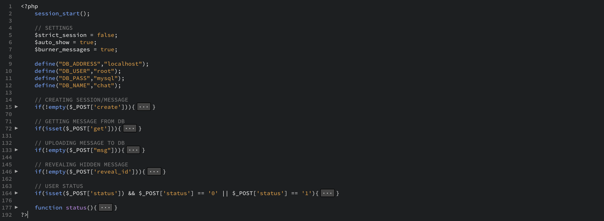
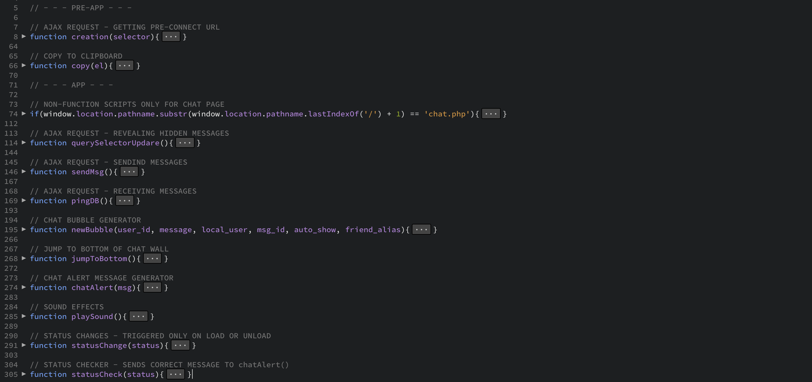
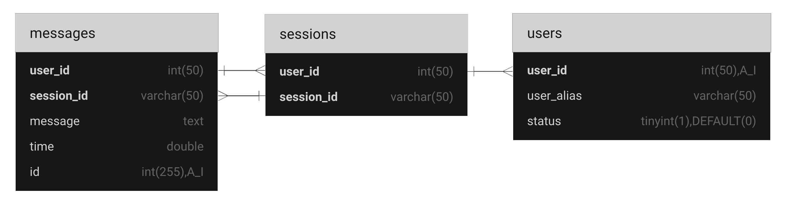
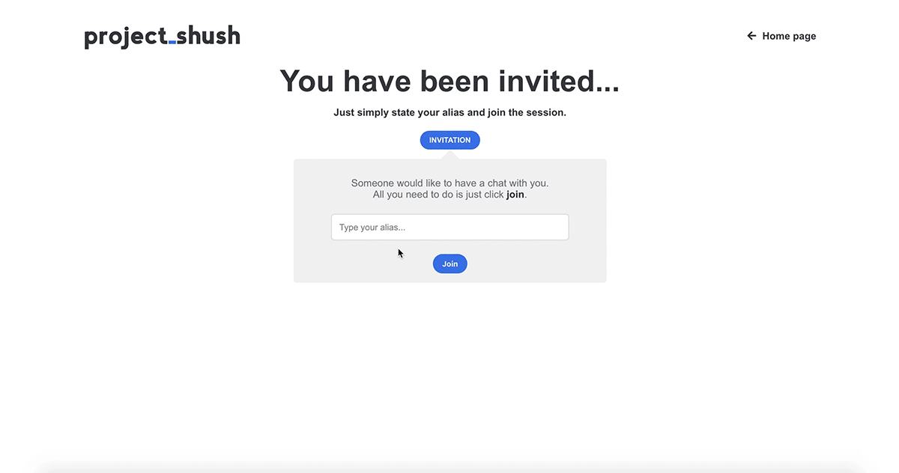
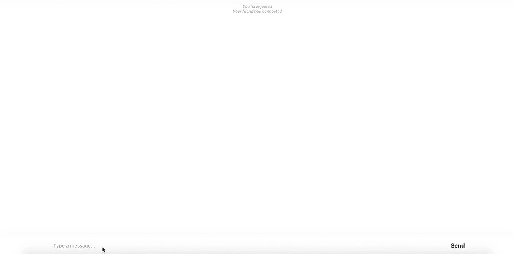

www.shush.us.lt

## Jump to...

  - [How does it work](#Work)
  - [TODO](#TODO)
  - [Bugs](#Bugs)
  - [What have I learned](#Learned)

## Intro

This is the outcome of a project that I developed at Vilnius Coding School while taking their one-month web developing course. I choose this kind of project so I could get the most out of the course, also just wanted to see how well I could develop an app from start to finish. But the most important reason is that it looked a whole lot of fun!

So the initial idea was to make a one-time use chat service, that did not require any registration or personal information and was extremely straightforward to use for the end user. And it all went from there.

This project consists of 3 different sections:
- [Landing/product page](#Landing)
- [pre-app](#pre-app)
- [app](#app)

## How does it work

### File architecture and database scheme

**process.php** - is the brain of the whole operation. It is responsible for creating new chat sessions, dealing with messages and user status.

**chat.php** - *is the only PHP code that is outside process.php. It is responsible for authenticating or creating a new user and re-directing him to the right place.*

**script.js** - *is a mishmash of ajax requests and code for better interactiveness.*

**Database** - *I am fully aware that this DB scheme design isn’t the best, but as this is the first time for me working with a database this will do.*

###  Landing/product page

As the course I was taking was mainly focused for developing WordPress responsive websites and not specifically web app’s, I figured to not go too far of the track I’ll make a responsive landing page for my app.

### pre-app

the pre-app section consists of two different parts - creation page and invitation page.

The invitation page is triggered when you get invited to a new session for the first time. On this page, the only thing you can do is state your alias(or not, it’s optional), click “join” and proceed to the session.

The creation page does exactly that what the title states - “creates” a session. Here you can choose your alias and adjust the setting of your choosing. But as I stated before I wanted this to be as easy of a setup as possible, so you can actually leave the alias blank as it is an optional requirement and just simply proceed on creating your chat session right away.

The creation page is basically the index page of the app. If you’ll try accessing other parts of the app without proper authentication you’ll probably end up here.

Upon pressing the create button an ajax request is sent to process.php, where a unique 10 character random string is generated, everything is uploaded to the database, certain information saved to $_SESSION for user authentication and finally ajax callback returns a unique link to the javascript.

### app

The first thing that happens when joining a chat session is user authentication. That basically works like this:
  - non-existing session url -> re-direct to app index
  - existing session url -> session is full -> re-direct to app index
  - existing session url -> session not full -> $_SESSION credentials do not match on database -> create new user -> procees to session
  - existing session url -> $_SESSION credentials match on database -> procees to session

Right after the authentication a js script will trigger and send an update of your status to the database that you have connected. User status is a feature for a better user experience so that users could see if the other user is connected or disconnected.

## TODO

  - All around good encryption, preferably end-to-end
  - pre-app and in-app settings
  - Add an alternative communication method - one-way burner message

## Bugs

  - Easy to manipulate your “status” though js injection. Triggering a specific function will give the other user a notice that you have disconnected from the session, while you still being able to read and reply to messages.
  - At some specific situations, user “status” will not alert that user has left the chat - user status is updated by event listeners that detect page closing(disconnect) and page loading(connect). So in a case where session #1 is active while on the same browser a new tab session #2 was created. In this case, session #1 will seamlessly become session #2. S in this instance, there was no page reload -> event listener didn’t trigger -> session #1 status still “connected”.
  - Message loss - If two messages are sent at the same time(millisecond accuracy), there is a chance on one of them disappearing.
  
## What have I learned and impoved on

### HTML&CSS
Writing efficient dry CSS, maximizing accessibility and responsiveness. But still, need to work on consistent CSS naming methodology. Regarding the actual HTML, there was nothing that big that I learned that I haven’t known before, just some tricks here and there for readability, validity, and SEO.

### UI&UX
Making UI wasn’t too difficult because of previous experience with graphic design. But on the other hand UX was a whole another story. Right from the start, I knew that I want to make this app as straightforward as possible. So designing everything from scratch without using any kind of template I had to go through some trial and error, and that actually help me on understanding how UX design works. And in the end, I think I did a pretty good job with some room for improvement.

### AJAX&JSON
Considering the lack of my knowledge in networking and that Ajax wasn’t a part of the course, I got a grasp for it pretty fast. The start was a bit rough, but after a couple of days of trying and failing, I got a hang of it. A big factor to note that I decided to do this project without using jQuery which made learning on my own extremely challenging. The lack of documentation(except the MDN one) or examples that use vanilla js was just underwhelming.

### Networking
Got a glimpse at how some basic networking works on a web site(HTTP and POST/GET methods)

### MySQL&Database
Gained a solid understanding of how basic MySQL works and feel pretty comfortable working with it. But nevertheless big emphasis on “basic”. There is a lot of room for improvements. For example learning best practices for database table architecture, efficiency, and most importantly security.

### PHP&Javascript
Improved a lot in writing clean, dry code. Learned how to write code into “sections” to reduce indentation nesting and improve reusability and readability. Specifically, with PHP, the most notable things that I learned are: how to work with POST/GET methods, JSON, MySQL query's, php sessions and how to escape users input to prevent XSS.

### Security
Got to know with some basic web security measures on how to protect from XSS, csrf, and other injections. The only part I am sad that I did not have time to play with is encryption. Especially I was looking forward to learning how end-to-end encryption work and how to apply it to my app.
